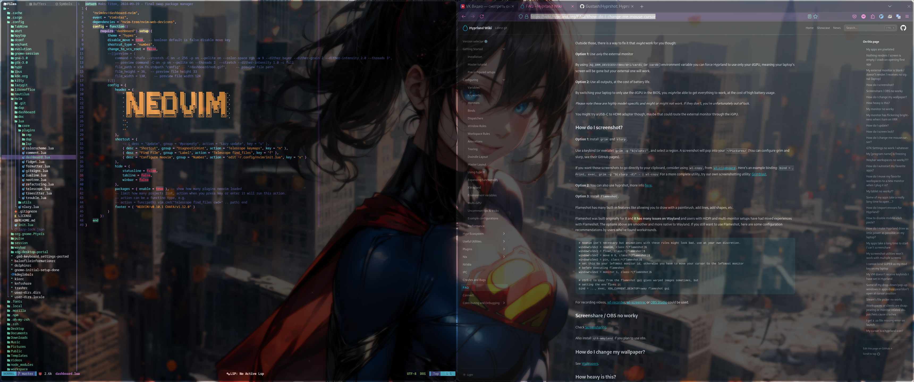

# MyHypr fedora  
Monitor 1920x1080  
<div align="center">
    
</div>  

Monitor 3440x1440  
<div align="center">
    
</div>  

enable right mouse click  
```sh
gsettings set org.gnome.desktop.peripherals.touchpad click-method 'areas'
sudo dnf -y update
```

install hyprland  
```sh
sudo dnf copr enable solopasha/hyprland -y
sudo dnf install -y hyprland
```

install dependencies  
```sh
sudo dnf install -y xdg-desktop-portal-hyprland hyprwayland-scanner hyprpaper waybar dolphin hyprlock nm-applet hyprcursor hyprshot
```  

clone config  
```sh
git clone --depth=1 https://github.com/makstag/MyHypr.git ~/.config
```  

check devices  
```sh
hyprctl devices
```  
check monitors  
```sh
hyprctl monitors
```
# Useful  
https://wiki.hyprland.org/FAQ  
[keymap...](https://github.com/makstag/MyHypr/blob/9b81aa97a7e81a634b00edbe69882fe5811013d0/hypr/hyprland.conf#L191)
